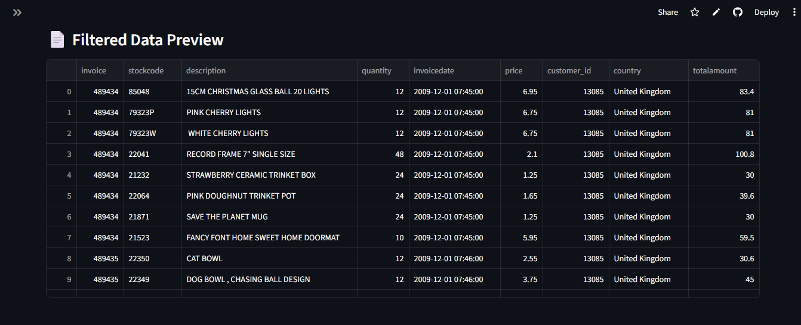
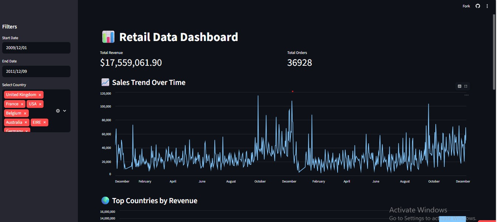
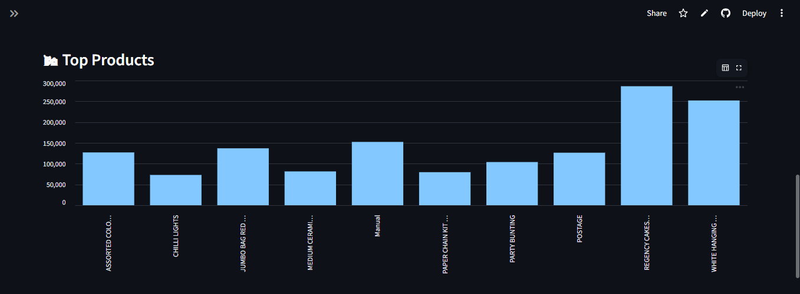
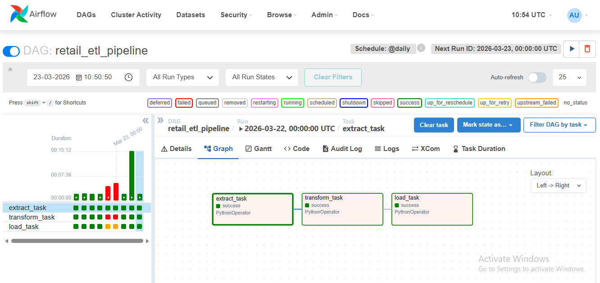
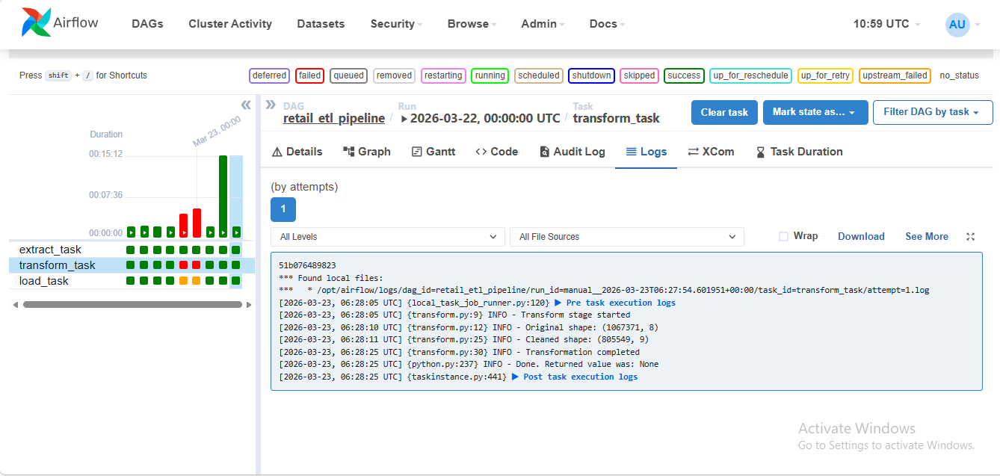
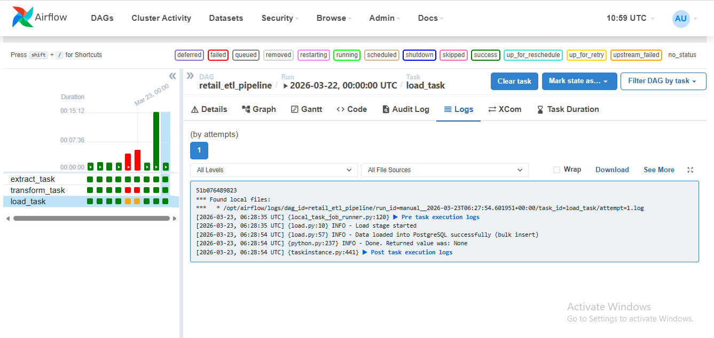

# 📊 Enterprise Data Cleaning & ETL Orchestration Framework


---

## 🚀 Project Overview

This project implements an end-to-end **ETL (Extract, Transform, Load) pipeline** using Python and Apache Airflow.
It processes raw retail transaction data, performs cleaning and transformation, loads it into a PostgreSQL data warehouse, and visualizes insights through an interactive dashboard.

---

## 🎯 Key Features

* Automated ETL pipeline using Airflow DAGs
* Data cleaning and transformation using Pandas
* Workflow scheduling, retries, and logging
* Email alerts on task failure
* Data loading into PostgreSQL (data warehouse)
* Interactive dashboard using Streamlit
* Cloud deployment using Streamlit Cloud

---

## 🏗️ Project Architecture

Raw Data → Airflow ETL Pipeline → Processed Data → PostgreSQL → Streamlit Dashboard

---

## 📂 Project Structure

```
ETL-Project/
│
├── dags/
│   ├── retail_etl_dag.py
│   └── src/
│       ├── extract.py
│       ├── transform.py
│       └── load.py
│
├── data/
│   ├── raw/
│   └── processed/
│       └── cleaned_retail.csv
│
├── screenshots/
│   ├── dashboard_kpi.png
│   ├── dashboard_charts.png
│   ├── dashboard_filters.png
│
├── dashboard.py
├── requirements.txt
├── docker-compose.yaml
└── README.md
```

---

## ⚙️ Tech Stack

* Python
* Apache Airflow
* Pandas
* PostgreSQL
* Streamlit
* Docker

---

## 🔄 ETL Workflow

### 1. Extract

* Reads raw retail dataset from CSV
* Validates file existence

### 2. Transform

* Handles missing values
* Converts data types
* Removes invalid records
* Creates new feature: `TotalAmount`

### 3. Load

* Loads cleaned data into PostgreSQL
* Optimized using bulk insert for performance

---

## 📊 Dashboard Features

* Total Revenue & Total Orders (KPIs)
* Sales trend over time
* Top countries by revenue
* Top products by revenue
* Interactive filters (date & country)

---

## 🌐 Live Demo

👉 https://etl-project-6yhxaiayboddqrusnjtdsh.streamlit.app/

---

## 📸 Project Screenshots

### 📊 Dashboard – Filters



### 📊 Dashboard – KPIs



### 📊 Dashboard – Top Products



---

### 🔄 Airflow DAG



---

### 📝 ETL Pipeline Logs

#### Extract Stage


#### Transform Stage



#### Load Stage



---

## 📈 Sample Insights

* Identify top-performing countries
* Analyze revenue trends over time
* Discover best-selling products

---

## 📚 Key Learnings

* Built an end-to-end ETL pipeline using Apache Airflow
* Implemented data cleaning and transformation using Pandas
* Optimized database loading using PostgreSQL bulk insert
* Designed an interactive dashboard using Streamlit
* Deployed a data application on Streamlit Cloud

---

## ▶️ How to Run Locally

### 1. Clone Repository

```
git clone https://github.com/SadiyaSadaf17/ETL-Project.git
cd ETL-Project
```

### 2. Run Airflow

```
docker compose up
```

### 3. Run Dashboard

```
streamlit run dashboard.py
```

---

## 💡 Challenges & Solutions

**Problem:** Slow data loading into PostgreSQL
**Solution:** Implemented bulk insert using COPY for performance optimization

---

## 🔮 Future Enhancements

* Cloud database integration (Supabase/AWS RDS)
* Advanced dashboards with Power BI/Tableau
* Data warehouse modeling (Star Schema)
* Real-time streaming pipeline

---

## 👥 Team Members

* **Sadiya Sadaf** – ETL Pipeline Development, Airflow Orchestration, Dashboard
* **Rachi** – Data Cleaning & Transformation
* **Keerthana** – Deployment & Testing

---

## ⭐ If you like this project

Give it a star on GitHub ⭐
